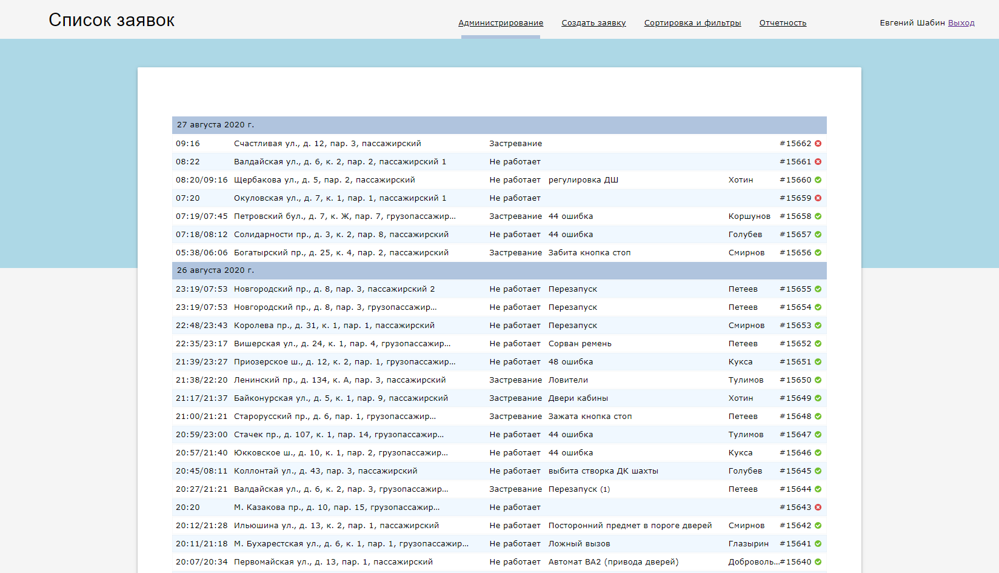
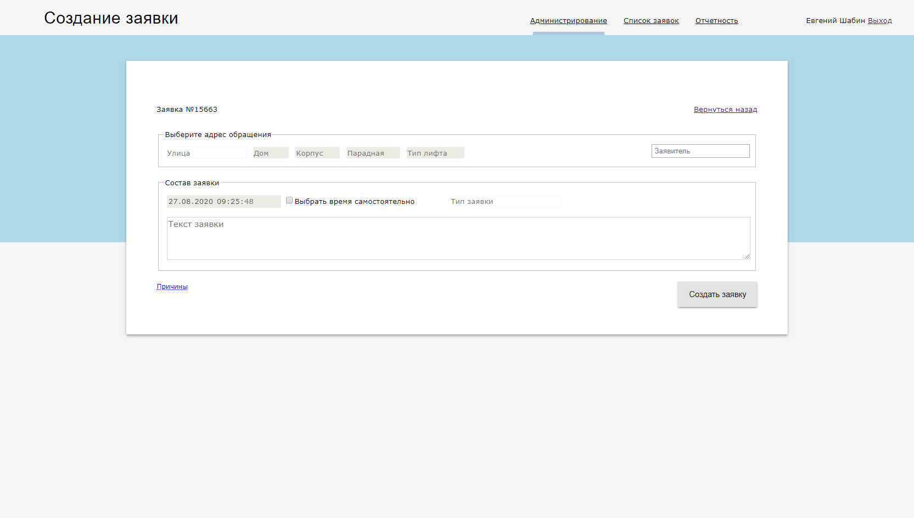
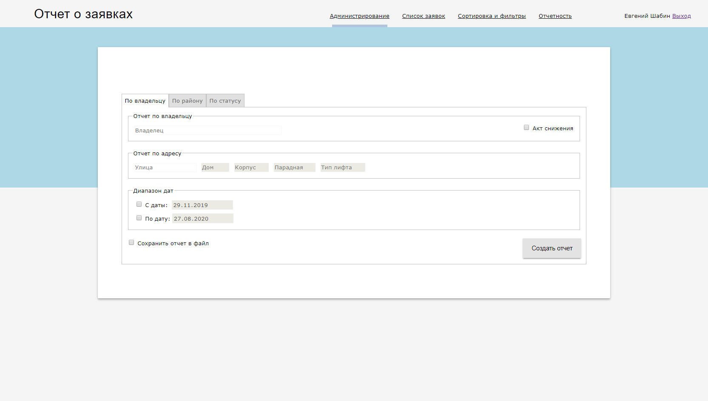
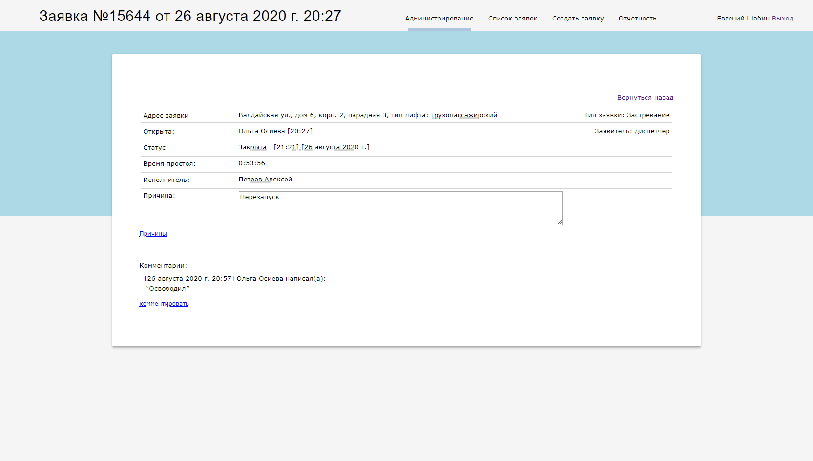

# Created by order "Master Lift"
# Django web application project for make and collect tickets of repair and maintenance elevator equipment, tracking the current status and downtime of equipment. 
# Also progect allows make some statistics, support SCV file export.
# Used: Django 2.25 PostgreSQL 9.6
#
# coded by germka
# email: germka@gmail.com
#
# Screenshots

